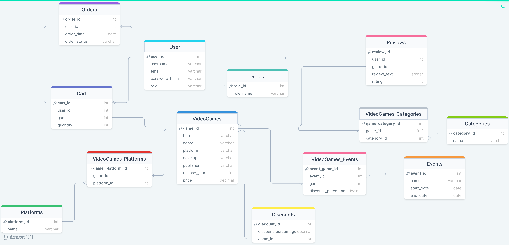

# DM-DMBS
# Knyazev Nikita, 153504
Тема проекта - "Интернет-магазин видеоигр".
## Функциональные требования
Админ:
* Управление пользователями(CRUD);
* Управление товарами(CRUD);
* Следить за действиями пользователей;
* Изменять роль пользователя;

Пользователь:
* Добавление или удаления товара из корзины;
* Создавать заказ;
* Смотреть историю заказов;
* Писать отзывы;
* Возврат средств;

Неавторизованный пользователь:
* Вход в личный профиль;
* Регистрация личного профиля;
* Просмотр списка товаров;
* Просмотр списка товаров по категориям;
* Просмотр деталей товаров;
* Просмотр отзывов;

# Схема БД

## "Users":
* user_id (PK, int) - Уникальный идентификатор пользователя.
* username (varchar) - Имя пользователя.
* email (varchar) - Электронная почта пользователя.
* password_hash (varchar) - Хэш пароля пользователя.
  
## "Roles":
* role_id (PK, int) - Уникальный идентификатор роли.
* role_name (varchar) - Название роли (Admin, User).

## "VideoGames":
* game_id (PK, int) - Уникальный идентификатор видеоигры.
* title (varchar) - Название видеоигры.
* genre (varchar) - Жанр видеоигры.
* platform(varchar) - поддерживаемые платформы.
* developer (varchar) - Разработчик видеоигры.
* publisher (varchar) - Издатель видеоигры.
* release_year (int) - Год выпуска видеоигры.
* price (decimal) - Цена видеоигры.

## "Cart":
* cart_id (PK, int) - Уникальный идентификатор корзины.
* user_id (FK, int) - Идентификатор пользователя, которому принадлежит корзина.
* game_id (FK, int) - Идентификатор видеоигры, добавленной в корзину.
* quantity (int) - Количество товаров в корзине.

## "Orders":
* order_id (PK, int) - Уникальный идентификатор заказа.
* user_id (FK, int) - Идентификатор пользователя, сделавшего заказ.
* order_date (datetime) - Дата оформления заказа.
* order_status (varchar) - Статус заказа (Ожидает оплату, В обработке, Завершен и т. д.).

## "Reviews":
* review_id (PK, int) - Уникальный идентификатор отзыва.
* user_id (FK, int) - Идентификатор пользователя, оставившего отзыв.
* game_id (FK, int) - Идентификатор видеоигры, к которой относится отзыв.
* review_text (text) - Текст отзыва.
* rating (int) - Рейтинг отзыва.

## "Categories":
* category_id (PK, int) - Уникальный идентификатор категории.
* name (varchar) - Название категории (например, "Экшен", "Головоломки", "Стратегии" и т. д.).

## "Platforms":
* platform_id (PK, int) - Уникальный идентификатор платформы.
* name (varchar) - Название платформы (например, "PlayStation 5", "Xbox Series X", "PC" и т. д.).

## "Discounts":
* discount_id (PK, int) - Уникальный идентификатор скидки.
* game_id (FK, int) - Идентификатор видеоигры, к которой применяется скидка.
* discount_percentage (decimal) - Процент скидки на видеоигру.

## "Events":
* event_id (PK, int) - Уникальный идентификатор события.
* name (varchar) - Название события (например, "Распродажа летних игр", "Хэллоуинские скидки" и т. д.).
* start_date (date) - Дата начала события.
* end_date (date) - Дата окончания события.
